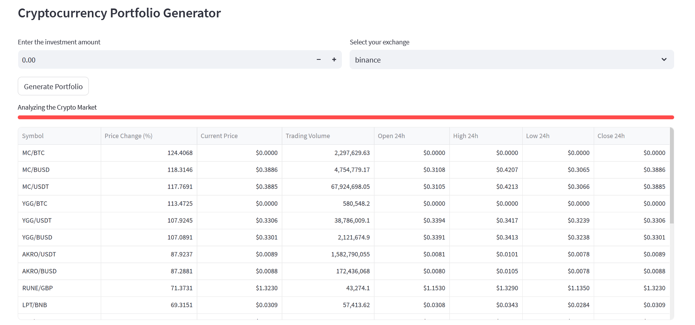

# Crypto Portfolio Generator

The Crypto Portfolio Generator is a Python application that allows you to generate and analyze a cryptocurrency portfolio based on data from various exchanges. This application is built using the Streamlit framework, CCXT library for cryptocurrency exchange data, and Pandas for data manipulation.

## Demo

Check out the live demo of the Crypto Portfolio Generator:

- **Demo Link:** [Crypto Portfolio Generator Demo](https://your-demo-link.com)

Please note that the demo version may have limitations or differences compared to the locally hosted version. Feel free to explore and test the application's features using the demo link.

## Screenshot



## Features

- Retrieve top 20 performing cryptocurrencies from selected exchanges.
- Calculate price changes, current prices, trading volume, and more.
- Analyze and visualize portfolio details using Streamlit's user interface.
- Export portfolio data to Excel or Google Sheets.
- Customize investment amount and exchange selection.

## Getting Started

1. Clone the repository:

   ```sh
   git clone https://github.com/yourusername/crypto-portfolio-generator.git

   ```

2. Install dependencies:

   ```
   pip install streamlit ccxt pandas
   ```

3. Run the application:

   ```
   Streamlit run app.py
   ```

4. Input your investment amount and select an exchange. Click the "Generate Portfolio" button to view the top 20 cryptocurrencies based on your investment.

## Usage

1. Enter your investment amount and select an exchange from the dropdown menu.
2. Click the "Generate Portfolio" button to retrieve and display the top 20 cryptocurrencies.
3. Analyze the portfolio's performance, price changes, trading volume, and more.
4. Optionally, click the "Export to Excel" or "Export to Google Sheets" buttons to save the portfolio data.

## Dependencies

Streamlit
CCXT
Pandas

## Acknowledgements

Streamlit: https://streamlit.io/
CCXT: https://ccxt.trade/
Pandas: https://pandas.pydata.org/

## Contact Information

If you have any business inquiries or questions, Please feel free to contact us:

- **Email:** [info@avionanalytics.com](mailto:info@avionanalytics.com)

## Disclaimer

The Crypto Portfolio Generator is provided for educational and entertainment purposes only. It is not intended to provide financial or investment advice. The information presented by this application should not be considered as professional financial advice or recommendations.

Cryptocurrency investments are subject to high market risks, including volatility and potential loss of capital. The application's analysis and calculations are based on historical data and general trends, and they may not accurately reflect future performance.

Always conduct thorough research and consult with a qualified financial advisor before making any investment decisions. The creators of this application do not assume any responsibility for financial losses incurred as a result of using the Crypto Portfolio Generator. Users are solely responsible for their investment choices and actions.

Please use this application responsibly and at your own risk.

## License and Liability

By using this project, you agree to the terms of the license. The creators of this project disclaim any liability for any damages or losses incurred while using this application.
